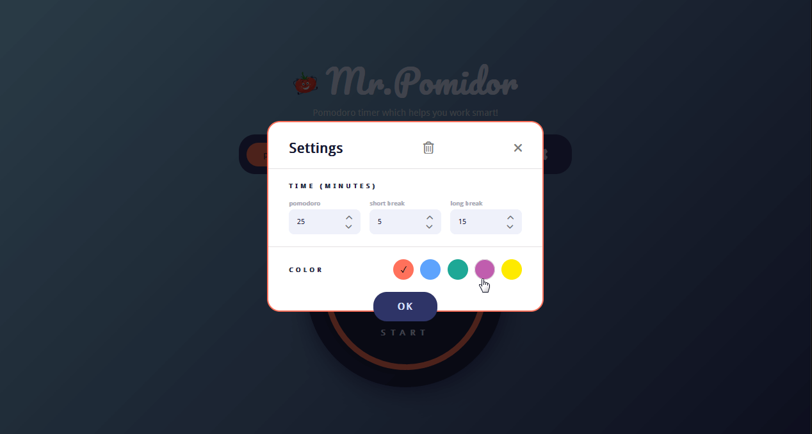

# Mr.Pomidor
Useful and customizable Pomodoro timer, which helps you work smart!

  
  You can set the timer as you like, adapting it to your work rhythm.
  
  By default:
  * Work time = 25 minutes;
  * Short break = 5 minutes;
  * Long break = 15 minutes.
  
  You can set the time from 1 to 60 minutes.
  
  All app settings are saved in the browser localStorage. You can reset user data in the settings by clicking on the "recycle bin" icon.
  
  
  
  You can also customise the colour of the progress bar to your liking, choosing from five colours.
  
 ## What will be released in future versions:
 * Full screen mode.
 * A more user-friendly mobile version.
 * Flexible font options.
